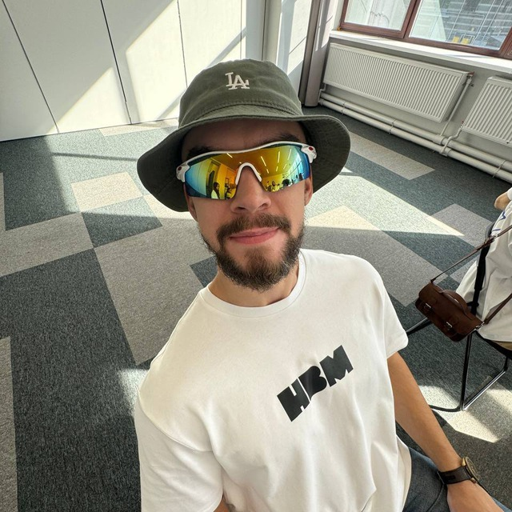

# Привет!  
Меня зовут Валентин Танцюра

Добро пожаловать в мой проект по DevOps.  
Здесь я делюсь результатами лабораторных работ, связанными с контейнеризацией, CI/CD и мониторингом систем.

---

## О проекте

Этот проект создан с помощью [MkDocs Material](https://squidfunk.github.io/mkdocs-material/).  
Цель — оформить документацию по курсу "Введение в DevOps" и освоить основы работы с Markdown, MkDocs и Docker.

---

## Что внутри

1. **Лабораторная №1:** Основы Docker  
2. **Лабораторная №2:** CI/CD пайплайн  
3. **Лабораторная №3:** Мониторинг с Prometheus и Grafana  
4. **Лабораторная №4:** Автоматизация с Ansible

---

## Используемые технологии

- Docker  
- GitHub и GitLab  
- Prometheus и Grafana  
- MkDocs Material  

---

## Пример изображения

---

## Цитата

> "DevOps — это не инструмент, а культура."  
> — Patrick Debois

---

## Полезные ссылки

- [Официальный сайт курса ITMO](https://itmo.ru)  
- [Документация по Docker](https://docs.docker.com)  
- [MkDocs Material Docs](https://squidfunk.github.io/mkdocs-material/)